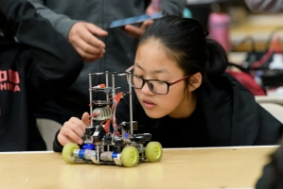
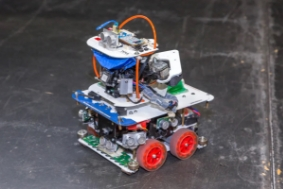
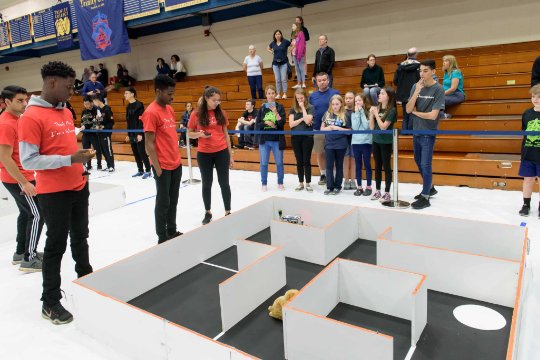

**Project Praktikum**  

**Eksperimen Robotika 1** 

1. **Pendahuluan** 

Projek Eksperiment Robotika 1 Tahun 2022-2023 mengacu pada peraturan yang dikeluarkan oleh Trinity College Fire Fighting Robot Contest 2010, Connecticut, Hartford, USA(https://trinityrobotcontest.org).  Namun  dalam  beberapa  hal  dialakukan  modifikasi dan penyesuaian dengan kondisi yang ada untuk menyesuaikan kebutuhan peralatan dan modul pembelajaran. Tugas Robot, mulai dari Start (HOME), bernavigasi di ruangan untuk mencari titik Target(FINISH) dan kembali ke Start (*return trip*), dimana posisi Start dan Target ditentukan secara acak (*Arbitrary Start*). 

 

Gambar 1.  Robot FireFighting

2. **Rule Eksperimen Robotika 1** 

Praktikum  Eksperimen  Robotika  1  merupakan  praktikum  berbasis  project  yang dikerjakan oleh kelompok mahasiswa selama satu semester dengan topik permasalahan yang  ada  di  lapangan,  luaran  pada  praktikum  ini  berupa  prototype  robot  yang  dapat memberikan solusi dari topik yang ditawarkan, yaitu berupa sistem mekanik, elektrik, dan software. Untuk melakukan ujicoba sistem maka lingkungan(arena) dan objek yang ada di industri  akan  dibuat  berupa  miniatur  sebagai  media  simulasi  keadaan  dilapangan Ketentuan dalam mengerjakan prototype robot adalah sebagai berikut:

1. Kelompok
   1. Setiap Kelompok terdiri dari maksimal 6 mahasiswa yang terdiri dari:
      1. Koordinator  Project  :  sebagai  koordinator  kelompok  dan  proses pembuatan robot
      1. Elektrical Engineering : bertugas pada sistem elektronik robot
      1. Software Engineering : bertugas pada sistem software robot
      1. Mechanical  Mobile  Robot  Engineering  :  bertugas  pada  sistem  mekanik robot
      1. Manufacture Engineering : bertugas pada sistem manufaktur mekanik dan elektronik robot
2. Spesifikasi Robot
   1. Dimensi maksimal robot adalah 30cm(P) x 30 cm(L) x 30cm(T)
   1. Robot  dengan  catu  daya  sendiri  berbentuk  baterai  kering  atau  melalui  kabel menggunakan catu daya dari power supply
   1. Supply/Tegangan pada baterai maksimal adalah 13v
   1. Jenis kontroler Robot bersifat programable
2. Spesifikasi Arena
1. Alas arena terbuat dari PVC Board / MMT Banner
1. Gambar Arena:

720 1710 150

Gambar 3. Arena Robot 

3. LAPANGAN: 
   1. Berfungsi untuk mensimulasikan sebuah rumah dan perlengkapannya. 
   1. Lapangan terbuat dari kayu/Karton/sterofoam dengan ketebalan 1,8 s.d. 2 cm. Lapangan berukuran 248 cm x 248 cm x 15 cm. Di dalam lapangan ini terdapat 4 ruangan dengan posisi tetap. 
3. PINTU: 
   1. Pintu merupakan suatu celah masuk keruangan yang berukuran 46 cm. Pada setiap pintu masuk tersebut terpasang garis HITAM di lantai dengan lebar 2,5 cm. 
3. START/HOME
   1. Start  merupakan  titik  posisi  awal  dari  robot.  Home  berfungsi  sebagai acuan titik awal dan akhir robot dalam mulai menjalankan dan mengakhiri tugasnya. Home terletak di lantai dan dapat dipindah-pindahkan. 
   1. Posisi Home diacak dengan Kandidat posisi diruang 1,2,3,atau 4.
   1. Object terbuat kertas berwarna HITAM.
   1. Ukuran diameter 30 cm
3. FINISH
1. Start merupakan titik posisi Target dari robot. FINISH berfungsi sebagai acuan robot mencapai TARGET yang telah ditentukan. FINISH terletak di lantai dan dapat dipindah-pindahkan. 
1. Posisi FINISH diacak dengan Kandidat posisi diruang 1,2,3,atau 4.
1. Object terbuat kertas berwarna MERAH.
1. Ukuran diameter 30 cm
3. **Format Learning Journal (Laporan)**  

Learning  Journal  merupakan  laporan  dan  evaluasi  kegiatan  pembuatan  robot  secara berkala,  dikumpulkan  pada  saat  jadwal  presentasi  progres  pembuatan  robot  dengan menyesuaiakn penjadwalan presentasi pada kontrak perkuliahan praktikum. Isi learning journal sebagai berikut:

1. Data Kelompok
1. Timeline kegiatan
1. Prosedur/langkah kerja
1. Proses dan hasil Mekanik
1. Proses dan hasil Elektrik
1. Proses dan hasil software
1. Evaluasi dan rencana Langkah kerja selanjutnya.
*TRKB-FTMM 2022*
